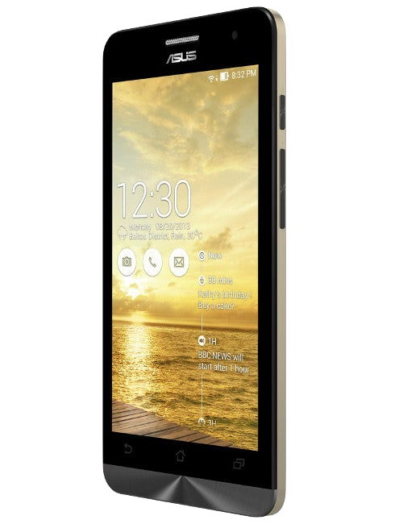
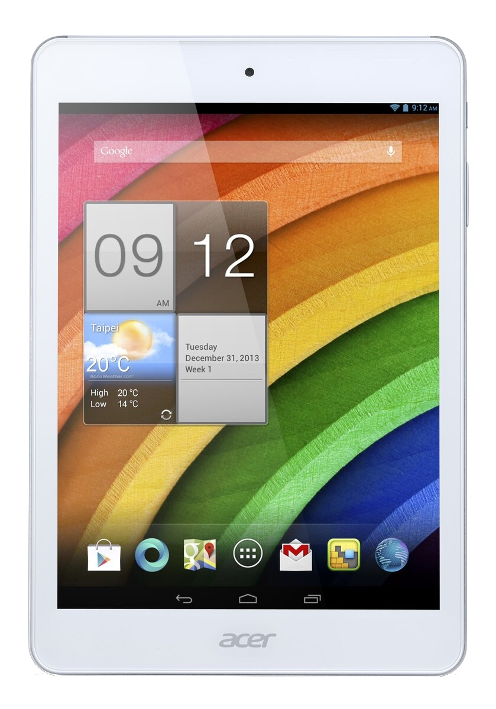
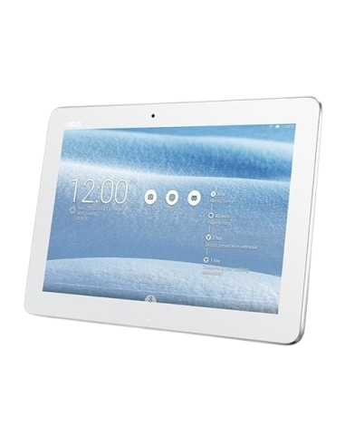
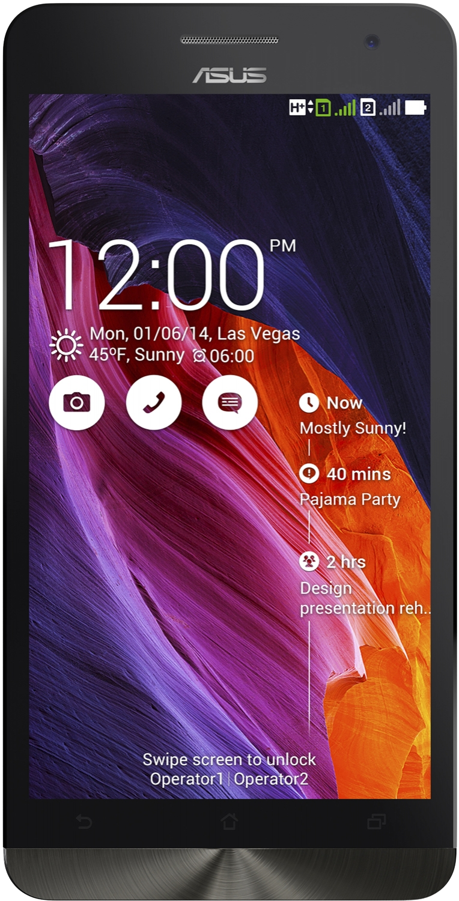

| Symbol | Meaning      |
|:------:|:------------:|
| ✅     | Working     |
| ⚠️     | Problematic |
| ❌     | Not Working |
| ❔     | Unknown     |

## Supported Devices

<b><strong>Intel Atom z25xx (Cloverview)</strong></b>

 

<b><strong>Intel Atom z2520</strong></b>

## Asus Zenfone 5 Lite (A502CG)

**Codename:** t00k

**Maintainer:** [v1-727](https://github.com/v1-727/)

### UEFI Status

| Feature            | Description    | State |
|:-------------------|:---------------|:-----:|
| Display            |                | ✅    |
| Internal Storage   |                | ❌    |
| SD Card            |                | ✅    |
| Side Buttons       |                | ❌    |
| USB Host Mode      |                | ✅    |
| Windows Boot       |                | ✅    |
| Linux Boot         |                | ❌    |

### OS Status

<table>
<tr><th>Windows</th></tr>
<tr><td>

| Feature              | Description   | State |
|:---------------------|:--------------|:-----:|
| Internal Storage     |               | ❌    |
| SD Card              |               | ✅    |
| Side Buttons         |               | ❌    |
| Light Sensor         |               | ❌    |
| Accelerometer Sensor |               | ❌    |
| Temperature Sensor   |               | ❌    |
| Battery              |               | ❌    |
| USB Host Mode        |               | ✅    |
| Charging             |               | ❌    |
| WLAN                 |               | ❌    |
| CPU                  |               | ✅    |
| Touchscreen          |               | ✅    |
| Bluetooth            |               | ❌    |
| GPS                  |               | ❌    |
| Audio                |               | ❌    |
| GPU                  |               | ❌    |
| Camera               |               | ❌    |
| Display              |               | ✅    | 

</td></tr>
</table>

<b><strong>Intel Atom z2560</strong></b>

## Acer Iconia A1-830

**Codename:** ducati

**Maintainer:** [NUC](https://github.com/iNUCi/)

### UEFI Status

| Feature            | Description    | State |
|:-------------------|:---------------|:-----:|
| Display            |                | ✅    |
| Internal Storage   |                | ❌    |
| SD Card            |                | ✅    |
| Side Buttons       |                | ❌    |
| USB Host Mode      |                | ✅    |
| Windows Boot       |                | ✅    |
| Linux Boot         |                | ❌    |

### OS Status

<table>
<tr><th>Windows</th></tr>
<tr><td>

| Feature              | Description   | State |
|:---------------------|:--------------|:-----:|
| Internal Storage     |               | ❌    |
| SD Card              |               | ✅    |
| Side Buttons         |               | ❌    |
| Light Sensor         |               | ❌    |
| Accelerometer Sensor |               | ✅    |
| Temperature Sensor   |               | ❌    |
| Battery              |               | ❌    |
| USB Host Mode        |               | ✅    |
| Charging             |               | ❌    |
| WLAN                 |               | ✅    |
| CPU                  |               | ✅    |
| Touchscreen          |               | ✅    |
| Bluetooth            |               | ❌    |
| GPS                  |               | ❌    |
| Audio                |               | ❌    |
| GPU                  |               | ❌    |
| Camera               |               | ❌    |
| Display              |               | ✅    | 

</td></tr>
</table>

## ASUS Transformer TF103CG

**Codename:** k018

**Maintainer:** [icyllite](https://github.com/icyllite/)

### UEFI Status

| Feature            | Description    | State |
|:-------------------|:---------------|:-----:|
| Display            |                | ✅    |
| Internal Storage   |                | ❌    |
| SD Card            |                | ✅    |
| Side Buttons       |                | ❌    |
| USB Host Mode      |                | ✅    |
| Windows Boot       |                | ✅    |
| Linux Boot         |                | ❌    |

### OS Status

<table>
<tr><th>Windows</th></tr>
<tr><td>

| Feature              | Description   | State |
|:---------------------|:--------------|:-----:|
| Internal Storage     |               | ❌    |
| SD Card              |               | ✅    |
| Side Buttons         |               | ❌    |
| Light Sensor         |               | ❌    |
| Accelerometer Sensor |               | ✅    |
| Temperature Sensor   |               | ❌    |
| Battery              |               | ❌    |
| USB Host Mode        |               | ✅    |
| Charging             |               | ❌    |
| WLAN                 |               | ✅    |
| CPU                  |               | ✅    |
| Touchscreen          |               | ✅    |
| Bluetooth            |               | ❌    |
| GPS                  |               | ❌    |
| Audio                |               | ❌    |
| GPU                  |               | ❌    |
| Camera               |               | ❌    |
| Display              |               | ✅    | 

</td></tr>
</table>

<b><strong>Intel Atom z2580</strong></b>

## Asus Zenfone 6 (A600CG)

**Codename:** t00g

**Maintainer:** [v1-727](https://github.com/v1-727/)

### UEFI Status

| Feature            | Description    | State |
|:-------------------|:---------------|:-----:|
| Display            |                | ✅    |
| Internal Storage   |                | ❌    |
| SD Card            |                | ✅    |
| Side Buttons       |                | ❌    |
| USB Host Mode      |                | ✅    |
| Windows Boot       |                | ✅    |
| Linux Boot         |                | ❌    |

### OS Status

<table>
<tr><th>Windows</th></tr>
<tr><td>

| Feature              | Description   | State |
|:---------------------|:--------------|:-----:|
| Internal Storage     |               | ❌    |
| SD Card              |               | ✅    |
| Side Buttons         |               | ❌    |
| Light Sensor         |               | ❌    |
| Accelerometer Sensor |               | ❌    |
| Temperature Sensor   |               | ❌    |
| Battery              |               | ❌    |
| USB Host Mode        |               | ✅    |
| Charging             |               | ❌    |
| WLAN                 |               | ❌    |
| CPU                  |               | ✅    |
| Touchscreen          |               | ✅    |
| Bluetooth            |               | ❌    |
| GPS                  |               | ❌    |
| Audio                |               | ❌    |
| GPU                  |               | ❌    |
| Camera               |               | ❌    |
| Display              |               | ✅    |

</td></tr>
</table>

<b><strong>Intel Atom z35xx (Moorefield)</strong></b>

 

<b><strong>Intel Atom z3580 / z3590</strong></b>

## Asus Zenfone Zoom (ZX551ML)

**Codename:** z00xs

### Notes

64-bit Moorefield (Silvermont) part. The primary bootloader consumes a standard
Google `mkbootimg` image (header v0) instead of an Intel OSIP container; the UEFI
FD is placed in the "second bootloader" slot (loaded at `0x10F00000`, entered in
32-bit protected mode) and an ASUS `sig` blob is appended (presence-checked, not
verified). SEC (`IntelPkg/Sec/X64/SecEntry.nasm`) performs the protected->long-mode
switch and DxeIpl continues in long mode.

### UEFI Status

| Feature            | Description                 | State |
|:-------------------|:----------------------------|:-----:|
| Display            | Fixed-mode GOP, 1080x1920   | ❔    |
| Shell              | Boot to shell               | ❔    |
| Internal Storage   | No device drivers yet       | ❌    |
| SD Card            | No device drivers yet       | ❌    |
| Side Buttons       | No device drivers yet       | ❌    |
| USB Host Mode      | No device drivers yet       | ❌    |
| Windows Boot       |                             | ❔    |
| Linux Boot         |                             | ❔    |

